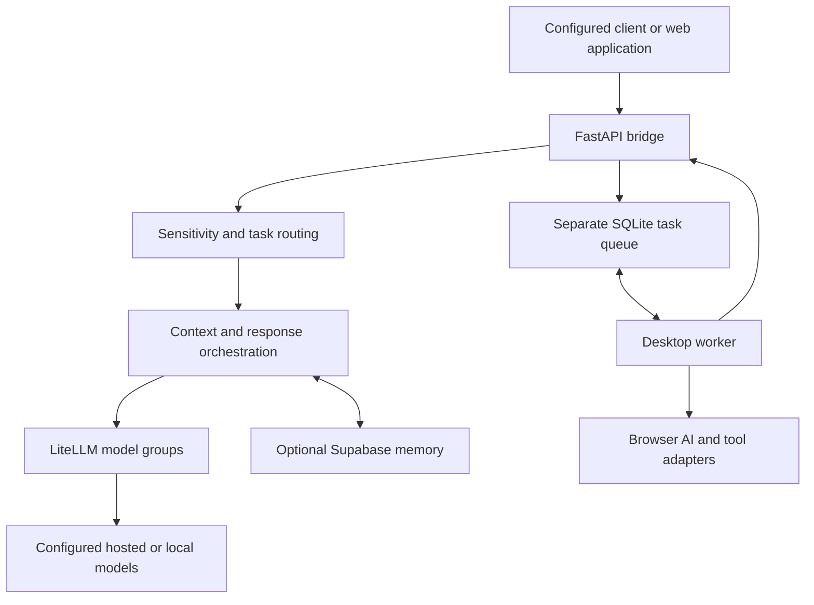
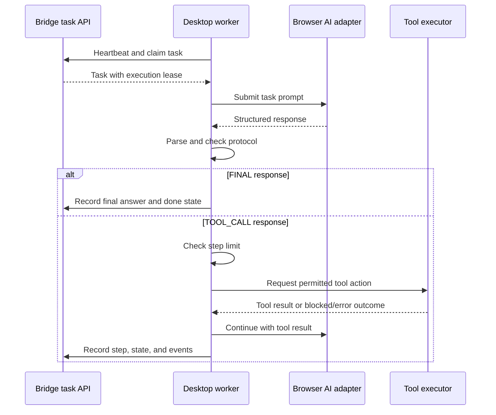

# DanielDoWork — AI Infrastructure

Browser-conversation planning, structured action dispatch, and companion AI services for the [DanielDoWork workspace](https://github.com/yo20ywork-max/danieldowork-showcase).

The web application owns the product interface and workspace workflows. This infrastructure provides configured model access, bridge APIs, optional memory and verification, and a separate desktop-worker execution loop. Its standalone development frontend has a different deployment path from the product website.

[Product architecture](https://github.com/yo20ywork-max/danieldowork-showcase#2-system-architecture) · [Source review map](SOURCE_REVIEW.md) · [Runnable parser](protocol/parser.py) · [Validation](VALIDATION.md)

This is a public architecture presentation with a selected source excerpt. The full operational stack remains private. The walkthrough follows selected paths in a fixed source snapshot, with configuration-dependent behavior identified below.

## 1. Browser conversation as the planning interface

The product concept is to express available OpenClaw actions in natural language, use GPT/Claude/Gemini web conversations to interpret a user's goal, and translate the response into work for an execution runtime.

This browser-conversation path is intended to support existing user accounts, including a supported free tier where available, without requiring a model API key for that path. It is separate from both the LiteLLM/API path and WebLLM inference running locally in a browser.

The inspected implementation has four contracts:

1. **Action vocabulary.** A prompt describes permitted action names, an objective, structured inputs, expected results, and the required response format.
2. **Machine-readable response.** The model returns `FINAL` or one `TOOL_CALL`; the parser validates the response before the worker continues.
3. **Execution adapter.** OpenClaw is invoked through a configured CLI or HTTP adapter, or simulated in fake mode. The source default is fake mode, so real execution requires explicit runtime configuration.
4. **Feedback.** The worker records the result and sends a `TOOL_RESULT` back to the same provider conversation.

An illustrative, synthetic protocol message is:

```text
TOOL_CALL:
{"tool":"openclaw","action":"browser_task","objective":"Read the title of the example page and return a short summary.","inputs":{"url":"https://example.com"},"risk":"low","needs_approval":false,"expected_result":"The observed page title and a short summary."}
```

This describes a high-level browser task. It is not JavaScript to evaluate, and the risk field is not an authorization decision. The execution layer must apply its own constraints before interacting with the target page.

The supported action vocabulary in this excerpt covers browser tasks, website checks, screenshots, form checks, local files, workflows, notes, and an explicitly configured email action. These categories describe the protocol, not a guarantee that every executor mode implements every action.

### Task lists, events, and DOM control

The architectural intention is to break a request into an execution checklist, advance work through events and state transitions, and expose browser actions at the execution stage.

The inspected desktop protocol accepts **one action per response**. The worker can continue through a bounded action/result loop, but its current result prompt normally requests a final answer after a tool result. The web application separately contains flow/task records, actor leases, wake records, and completion handling. These components do not by themselves prove a general dependency-aware planner across all routes.

The worker obtains work through polling and renewable leases. Recorded events and state changes describe progress; the delivery mechanism is not exclusively push-driven.

The OpenClaw wrapper forwards a high-level task to its configured executor. Separate web-repository code contains DOM primitives such as click, type, clear, select, scroll, navigation, and text/table extraction, with target checks and DOM-stability waits. The reviewed files do not prove that every OpenClaw action uses that particular DOM executor. They are separate implementation areas whose connection depends on the chosen runtime.

## 2. Service architecture



The bridge has a reply-oriented orchestration path and separate task/worker APIs. A reply does not need to travel through the desktop task queue. Likewise, the browser-AI worker can use its configured account adapter instead of LiteLLM.

| Component | Responsibility |
|---|---|
| `bridge/main.py` | Chat, employee/task APIs, context assembly, model-call orchestration, status and event handling |
| `bridge/sensitivity.py` | Local rules and heuristics; optional model classification; routing labels |
| `bridge/memory.py` | Optional interaction memory, embedding generation, filtered retrieval, and usage records |
| `litellm/` and `ollama-pool/` | Provider groups and local-inference configuration |
| `bridge/routes_worker.py` and `bridge/task_queue.py` | Worker authentication, durable task state, claims, leases, events, and retries |
| `desktop-ai-worker/` | Polling worker, browser-provider adapters, response parser, and tool executor integration |
| `bridge/routes_line.py` | A separate LINE ingress for the personal-AI task workflow |
| `frontend/` | Standalone WebLLM/WebGPU and operator interfaces |
| `dev/`, `monitoring/`, and `ops/` | Development composition, health inspection, and operational tooling |

## 3. How a chat request is handled

The inspected `/chat` implementation follows this sequence:

1. **Identify the session and task type.** Infer a task hint when one was not supplied. Eligible simple exchanges can take a local response path.
2. **Determine sensitivity.** Use an explicit hint or the classifier's local rules and heuristics. Remote classification is optional.
3. **Build an orchestration plan.** Choose model groups, whether planning or verification is needed, and how much context to retrieve.
4. **Assemble context.** Combine employee context, optional visual summary, recent learning records, and selected memory.
5. **Generate and optionally verify.** Call the configured model route; some plans add a planner, verifier, or revision pass.
6. **Return observable state.** Include the answer, session, route/provider labels, timings, and relevant memory or task references.
7. **Schedule configured persistence.** Record interactions and usage, and update supported memory/learning records.

The bridge also has cache and offline-replay paths. Cache eligibility depends on task, sensitivity, plan, and memory mode. Model-based verification is another model judgment, not independent proof of correctness.

### Memory and data location

Memory can be disabled when its database configuration is absent. When enabled, the inspected implementation writes to the configured Supabase database.

P2-classified content and force-local mode use local embeddings; other content can use a configured hosted embedding provider. The retrieval code filters candidate records and calculates cosine similarity in Python. Vector support in the schema does not mean this inspected function executes a database vector-index search.

The model route, embedding route, memory database, and usage/event records are distinct data paths. Choosing local inference alone does not establish complete local-only storage.

### Sensitivity routing

P0, P1, and P2 are policy labels for public, internal, and sensitive material. The classifier tries explicit labels, rules, and short-text heuristics before its optional model fallback. An unresolved classification defaults to P2.

The bridge selects the `secure` model group for P2 requests. Its actual destination is controlled by provider configuration. Caller-supplied labels and configurable model groups require appropriate deployment controls; they are not a standalone security guarantee.

## 4. Desktop-worker execution loop

This worker uses the bridge's task queue. The currently implemented queue backend is **SQLite**, with transactional claims, lease renewal, retry accounting, and a terminal state when retries are exhausted.



A separate renewal loop keeps a running task's lease alive. Protocol errors, account/browser failures, blocked tool calls, and exhausted step limits produce explicit task states. The adapter code captures diagnostic artifacts for some failures.

The worker includes fake/browser-fake modes and separately configured live adapters. Synthetic mode verifies orchestration behavior without establishing that a real provider session or tool integration works.

The public parser handles `FINAL` and `TOOL_CALL` messages, validates declared fields, and checks supplied risk/approval flags. The live executor has additional controls. A model's own risk label is not independent authorization, and a valid parsed tool call does not execute anything by itself.

## 5. How this connects to the web product

The Next.js application supplies workspace-aware access and routes selected requests to a personal device or configured bridge. It also has its own task and device-request implementation.

| Boundary | Web application's connector | This repository's desktop worker |
|---|---|---|
| Queue storage | Supabase device requests | Bridge SQLite task queue |
| Work acquisition | Application poll endpoint and lease token | Bridge claim endpoint and renewable task lease |
| Result reporting | Application completion endpoint and persisted completion effects | Bridge task state, events, final response, and configured delivery |
| Main purpose | Connect workspace requests to personal-device capabilities | Run the browser-AI/tool loop |
| Integration requirement | Matching application connector/runtime | Matching bridge worker API and configuration |

These are different protocols. A shared product name does not make their task IDs, queues, or deployment steps interchangeable.

The web repository also contains direct assistant workflows, personal-account integration, optional customer API routing, and bounded local processing. This bridge is one available subsystem, not the exclusive path for every AI feature.

## 6. Frontend and deployment boundaries

The infrastructure's `frontend/webllm-client.js` can initialize WebLLM when WebGPU is available. It includes local inference, a bridge call path, and an offline request queue. This development frontend does not replace the main Next.js application.

| Change | Required delivery path |
|---|---|
| Next.js pages and product APIs | Deploy the web repository from its `overpower-app` root |
| Bridge, routing configuration, or worker APIs | Update the corresponding infrastructure service |
| Desktop browser or execution adapters | Update the installed desktop worker |
| Model availability | Configure and operate the selected provider/local runtime |
| Memory or application schema | Apply changes to the correct database; they may use separate configurations |

The development composition and VM/service manuals describe different environment options. The effective configuration determines which components run. Updating this repository does not by itself change the website's deployed frontend.

## 7. Public example and recorded validation

From this public repository:

```bash
python -m pip install -r requirements-dev.txt
python -m pytest -q
```

The published [validation record](VALIDATION.md) reports **nine selected parser/guard tests passing**. They cover marker parsing, malformed and mixed responses, action validation, supplied risk/approval fields, and step limits.

The [source provenance](EVIDENCE.md) identifies the original parser and test selection. These tests do not open browsers, send messages, invoke a real executor, measure model quality, or validate the entire service stack.

This source walkthrough did not rerun a live bridge, model-provider requests, account sessions, database migrations, or full end-to-end acceptance. Those require the intended deployment and integration configuration.

## 8. Engineering questions exposed by the architecture

- **Recovery:** a task lease must survive slow model responses while expired or abandoned work remains recoverable.
- **Boundaries:** workspace authorization, bridge access, worker authentication, and tool authorization are separate responsibilities.
- **Observability:** a final answer, a completed tool action, a delivered message, and a persisted result need distinct evidence.
- **Maintainability:** the large bridge entry module and multiple execution paths create integration and documentation costs.
- **Reproducibility:** fake adapters, isolated protocol tests, live provider checks, and production acceptance answer different questions.

Original source identifier: `yo20ywork-max/danieldowork-ai`. This repository presents the infrastructure contribution within the same DanielDoWork product.

[Public disclosure scope](DISCLOSURE.md) · [Return to the product architecture](https://github.com/yo20ywork-max/danieldowork-showcase)
